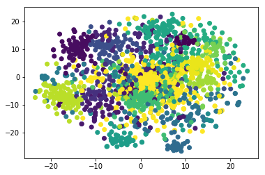
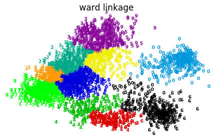
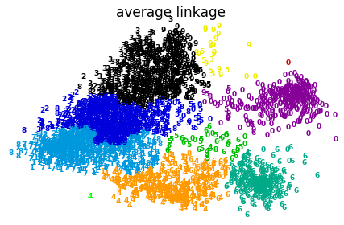
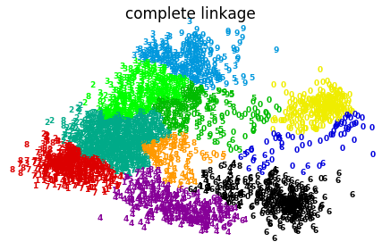
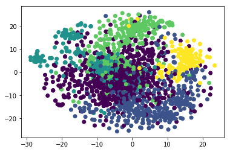
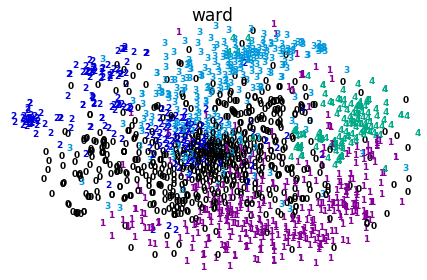
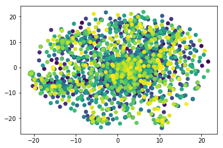

# K-means聚类

## K-means参数说明

```python
sklearn.cluster.KMeans(n_clusters=8,
     init='k-means++',
    n_init=10,
    max_iter=300,
    tol=0.0001,
    precompute_distances='auto',
    verbose=0,
    random_state=None,
    copy_x=True,
    n_jobs=1,
    algorithm='auto'
    )
```

参数的意义：

- n_clusters:簇的个数，即你想聚成几类
- init: 初始簇中心的获取方法
- n_init: 获取初始簇中心的更迭次数，为了弥补初始质心的影响，算法默认会初始10个质心，实现算法，然后返回最好的结果。
- max_iter: 最大迭代次数（因为kmeans算法的实现需要迭代）
- tol: 容忍度，即kmeans运行准则收敛的条件
- precompute_distances：是否需要提前计算距离，这个参数会在空间和时间之间做权衡，如果是True 会把整个距离矩阵都放到内存中，auto 会默认在数据样本大于featurs*samples 的数量大于12e6 的时候False,False 时核心实现的方法是利用Cpython 来实现的
- verbose: 冗长模式（不太懂是啥意思，反正一般不去改默认值）
- random_state: 随机生成簇中心的状态条件。
- copy_x: 对是否修改数据的一个标记，如果True，即复制了就不会修改数据。bool 在scikit-learn 很多接口中都会有这个参数的，就是是否对输入数据继续copy 操作，以便不修改用户的输入数据。这个要理解Python 的内存机制才会比较清楚。
- n_jobs: 并行设置
- algorithm: kmeans的实现算法，有：’auto’, ‘full’, ‘elkan’, 其中 ‘full’表示用EM方式实现

虽然有很多参数，但是都已经给出了默认值。所以我们一般不需要去传入这些参数,参数的。可以根据实际需要来调用。

## 代码


```python
from sklearn.cluster import KMeans
import numpy as np
```

### 获取数据


```python
def get_datalist(file_path):
    vecs_list=[]
    word_list = []
    with open(file_path,"r") as file:
        for line in file:
            line_split=line.replace("\n","").strip().split(" ")
            word = line_split[0]
            vec_list = [float(data) for data in line_split[1:]]
            word_list.append(word)
            vecs_list.append(vec_list)       
    return word_list,vecs_list
```


```python
file_path = "/Users/xiachi/PycharmProjects/credit_card/test/ls/domain_word.vec"
word_list,vecs_list = get_datalist(file_path)
vecs_matrix = np.matrix(vecs_list)
print(vecs_matrix.shape)
```

    (1693, 200)


### 聚类个数和inertia的关系


```python
# print("开始训练....")
# for num in range(20,100):
# #     num_clusters = 30
#     km = KMeans(n_clusters=num,algorithm="full",max_iter=600)
#     km.fit(vecs_matrix)
#     inertia = km.inertia_ # 获取聚类准则的总和
#     print("聚类个数:%s,inertia值为:%s:"%(str(num),str(inertia)))
# print("训练结束！")
```

### 指定簇个数训练


```python
num_clusters = 70
km = KMeans(n_clusters=num_clusters,algorithm="full",max_iter=600)
km.fit(vecs_matrix)
label_pred = km.labels_ #获取聚类标签
centroids = km.cluster_centers_ #获取聚类中心
inertia = km.inertia_ # 获取聚类准则的总和
ziped_list = zip(word_list,list(label_pred))
```


```python
with open("result.txt","w+") as file:
    for (word,label) in ziped_list:
        wtr_str = str(word)+"\t"+str(label)+"\n"
        file.write(wtr_str)
```

## 可视化聚类结果


```python
from sklearn.manifold import TSNE
import matplotlib.pyplot as plt
```


```python
tsne=TSNE()
X_Y = tsne.fit_transform(vecs_matrix)  #进行数据降维,降成两维
```


```python
plt.scatter(X_Y[:, 0], X_Y[:, 1],c=label_pred)
plt.show()
```





# 层次聚类

## 算法说明
AgglomerativeClustering是scikit-learn提供的层级聚类算法模型，其原型为：

```python
class sklearn.cluster.AgglomerativeClustering(
    n_clusters=2,
    affinity=’euclidean’,
    memory=None,
    connectivity=None,
    compute_full_tree=’auto’,
    linkage=’ward’,
    pooling_func=<function mean>)

```

### 参数

- n_clusters：一个整数，指定分类簇的数量
- connectivity：一个数组或者可调用对象或者None，用于指定连接矩阵
- affinity：一个字符串或者可调用对象，用于计算距离。可以为：’euclidean’，’l1’，’l2’，’mantattan’，’cosine’，’precomputed’，如果linkage=’ward’，则affinity必须为’euclidean’
- memory：用于缓存输出的结果，默认为不缓存
- n_components：在 v-0.18中移除
- compute_full_tree：通常当训练了n_clusters后，训练过程就会停止，但是如果compute_full_tree=True，则会继续训练从而生成一颗完整的树
- linkage：一个字符串，用于指定链接算法
- ‘ward’：单链接single-linkage，采用dmin
- ‘complete’：全链接complete-linkage算法，采用dmax
- ‘average’：均连接average-linkage算法，采用davg
- pooling_func：一个可调用对象，它的输入是一组特征的值，输出是一个数

### 属性
- labels：每个样本的簇标记
- n_leaves_：分层树的叶节点数量
- n_components：连接图中连通分量的估计值
- children：一个数组，给出了每个非节点数量

### 方法
- fit(X[,y])：训练样本
- fit_predict(X[,y])：训练模型并预测每个样本的簇标记

## 代码示例


```python
from time import time   
import numpy as np   
from scipy import ndimage   
from matplotlib import pyplot as plt   
from sklearn import manifold, datasets   

digits = datasets.load_digits(n_class = 10)  
X = digits.data   
y = digits.target   
n_samples, n_features = X.shape   

np.random.seed(0)  
def nudge_image(X, y):  
    shift = lambda x: ndimage.shift(x.reshape((8, 8)), .3 * np.random.normal(size = 2),  
         mode = 'constant').ravel()   
    X = np.concatenate([X, np.apply_along_axis(shift, 1, X)])  
    Y = np.concatenate([y, y], axis = 0)  
    return X, Y   

X, y = nudge_image(X, y)  

def plot_clustering(X_red, labels, title = None):  
    x_min, x_max = np.min(X_red, axis = 0), np.max(X_red, axis = 0)  
    X_red = (X_red - x_min) / (x_max - x_min)  

    plt.figure(figsize = (6, 4))  
    for i in range(X_red.shape[0]):
        plt.text(X_red[i,0], X_red[i,1], str(y[i]), color = plt.cm.spectral(labels[i]/10.),  
        fontdict = {'weight': 'bold', 'size': 9})  

    plt.xticks([])  
    plt.yticks([])  
    if title is not None:  
        plt.title(title, size = 17)  
    plt.axis('off')  
    plt.tight_layout()  

print("Computing embedding" )
X_red = manifold.SpectralEmbedding(n_components = 2).fit_transform(X)  
print("Done!")

from sklearn.cluster import AgglomerativeClustering   

for linkage in ('ward', 'average', 'complete'):  
 clustering = AgglomerativeClustering(linkage = linkage, n_clusters = 10)  
 t0 = time()  
 clustering.fit(X_red)  
 print("%s : %.2fs" % (linkage, time() - t0))
 plot_clustering(X_red, X, clustering.labels_, "%s linkage" % linkage)  

plt.show()
```

    Computing embedding
    Done!
    ward : 0.29s
    average : 0.27s
    complete : 0.24s











## 账单数据进行层次聚类

### 数据加载


```python
import numpy as np
```


```python
def get_datalist(file_path):
    vecs_list=[]
    word_list = []
    with open(file_path,"r") as file:
        for line in file:
            line_split=line.replace("\n","").strip().split(" ")
            word = line_split[0]
            vec_list = [float(data) for data in line_split[1:]]
            word_list.append(word)
            vecs_list.append(vec_list)       
    return word_list,vecs_list
```


```python
file_path = "/Users/xiachi/PycharmProjects/credit_card/test/ls/domain_word.vec"
word_list,vecs_list = get_datalist(file_path)
vecs_matrix = np.matrix(vecs_list)
print(vecs_matrix.shape)
```

    (1693, 200)


### 开始聚类


```python
from sklearn.cluster import AgglomerativeClustering
linkages=['ward','complete','average']
clustering = AgglomerativeClustering(linkage="ward",n_clusters = 120)
clustering.fit(vecs_matrix)
predicted_lables=clustering.fit_predict(vecs_matrix)
print(len(predicted_lables))
```

    1693


### 写入文件


```python
with open("hi_result.txt","w+") as file:
    for i,word in enumerate(word_list):
        wtr=word+"\t"+str(list(predicted_lables)[i])
        file.write(wtr+"\n")
```

### 可视化聚类结果


```python
from sklearn.manifold import TSNE
from matplotlib import pyplot as plt  
tsne=TSNE()
X_Y = tsne.fit_transform(vecs_matrix)  #进行数据降维,降成两维
plt.scatter(X_Y[:, 0], X_Y[:, 1],c=predicted_lables)
plt.show()
```





```python
def plot_clustering(X_red, labels, title = None):  
    x_min, x_max = np.min(X_red, axis = 0), np.max(X_red, axis = 0)  
    X_red = (X_red - x_min) / (x_max - x_min)  

    plt.figure(figsize = (6, 4))  
    for i in range(X_red.shape[0]):
        plt.text(X_red[i,0], X_red[i,1], str(labels[i]),color = plt.cm.spectral(labels[i]/10.),  
        fontdict = {'weight': 'bold', 'size': 9})  

    plt.xticks([])  
    plt.yticks([])  
    if title is not None:  
        plt.title(title, size = 17)  
    plt.axis('off')  
    plt.tight_layout()  
```


```python
plot_clustering(X_Y,predicted_lables,"ward")
plt.show()
```


    <matplotlib.figure.Figure at 0x10c036048>


    <matplotlib.figure.Figure at 0x10ce852b0>





# DBSCAN聚类

## 聚类


```python
#数据在层次聚类中加载了
from sklearn.cluster import DBSCAN
y_pred = DBSCAN(eps = 0.4, min_samples = 10).fit_predict(vecs_matrix)
print(len(list(set(y_pred))))
```

    1


## 可视化聚类结果


```python
from sklearn.manifold import TSNE
from matplotlib import pyplot as plt  
tsne=TSNE()
X_Y = tsne.fit_transform(vecs_matrix)  #进行数据降维,降成两维
plt.scatter(X_Y[:, 0], X_Y[:, 1],c=y_pred)
plt.show()
```



