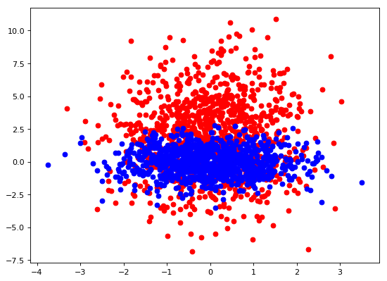
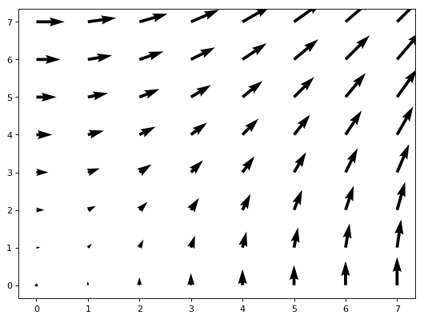
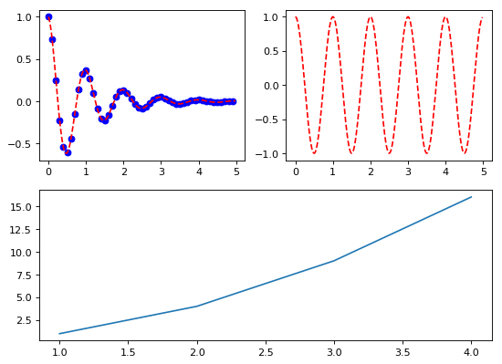

# 1、学习示例

## 1.1 pylab库画图


```python
import pylab as plb
import numpy as np
plb.figure(figsize=(8,6), dpi=80)
X = np.linspace(-np.pi,np.pi,256,endpoint=True)
(C,S)=np.cos(X),np.sin(X)
# 绘制余弦曲线，使用蓝色的、连续的、宽度为 1 （像素）的线条
plb.plot(X, C, color="blue", linewidth=1.0, linestyle="-")
plb.plot(X,S,color="red",linewidth=1.0,linestyle="-")
plb.show()
```


## pyplot库画图


```python
import matplotlib.pyplot as plt
import numpy as np
X = np.linspace(-np.pi,np.pi,256,endpoint=True)
(C,S)=np.cos(X),np.sin(X)
plt.figure(figsize=(8,6), dpi=80)
plt.subplot(111)

#绘制余弦
plt.plot(X, C, color="blue", linewidth=2.0, linestyle="-",label="cosine")

#绘制正弦
plt.plot(X, S, color="red", linewidth=2.0, linestyle="-",label="sine")

#边界设置得不好，所以有些地方看得不是很清楚
xmin ,xmax = X.min(), X.max()
ymin, ymax = C.min(), C.max()

dx = (xmax - xmin) * 0.2
dy = (ymax - ymin) * 0.2

#设置x轴上下限
plt.xlim(xmin - dx, xmax + dx)

# 设置横轴记号
plt.xticks(np.linspace(-4,4,9,endpoint=True))

# 设置纵轴的上下限
plt.ylim(ymin - dy, ymax + dy)

# 设置纵轴记号
plt. yticks(np.linspace(-1,1,5,endpoint=True))

#我们讨论正弦和余弦函数的时候，通常希望知道函数在 ±π±π 和 ±π2±π2 的值
plt.xticks([-np.pi, -np.pi/2, 0, np.pi/2, np.pi],
       [r'$-\pi$', r'$-\pi/2$', r'$0$', r'$+\pi/2$', r'$+\pi$'])

plt.yticks([-1, 0, +1],
       [r'$-1$', r'$0$', r'$+1$'])

# plt.show()
```


实际上每幅图有四条脊柱（上下左右），为了将脊柱放在图的中间，我们必须将其中的两条（上和右）设置为无色，然后调整剩下的两条到合适的位置——数据空间的 0 点。


```python
ax = plt.gca()
ax.spines['right'].set_color('none')
ax.spines['top'].set_color('none')
ax.xaxis.set_ticks_position('bottom')
ax.spines['bottom'].set_position(('data',0))
ax.yaxis.set_ticks_position('left')
ax.spines['left'].set_position(('data',0))
```

我们在图的左上角添加一个图例。为此，我们只需要在 plot 函数里以「键 - 值」的形式增加一个参数。


```python
plt.legend(loc='upper left')
```

我们希望在 2π/32π/3 的位置给两条函数曲线加上一个注释。首先，我们在对应的函数图像位置上画一个点；然后，向横轴引一条垂线，以虚线标记；最后，写上标签


```python
t = 2*np.pi/3
plt.plot([t,t],[0,np.cos(t)], color ='blue', linewidth=2.5, linestyle="--")
plt.scatter([t,],[np.cos(t),], 50, color ='blue')

plt.annotate(r'$\sin(\frac{2\pi}{3})=\frac{\sqrt{3}}{2}$',
         xy=(t, np.sin(t)), xycoords='data',
         xytext=(+10, +30), textcoords='offset points', fontsize=16,
         arrowprops=dict(arrowstyle="->", connectionstyle="arc3,rad=.2"))

plt.plot([t,t],[0,np.sin(t)], color ='red', linewidth=2.5, linestyle="--")
plt.scatter([t,],[np.sin(t),], 50, color ='red')

plt.annotate(r'$\cos(\frac{2\pi}{3})=-\frac{1}{2}$',
         xy=(t, np.cos(t)), xycoords='data',
         xytext=(-90, -50), textcoords='offset points', fontsize=16,
         arrowprops=dict(arrowstyle="->", connectionstyle="arc3,rad=.2"))
```

```python
plt.show()
```


## 散点图


```python
import matplotlib.pyplot as plt
import numpy as np
n = 1024
X_1 = np.random.normal(0,1,n)
Y_1 = np.random.normal(2,3,n)

X_2 = np.random.normal(0,1,n)
Y_2 = np.random.normal(0,1,n)
plt.figure(figsize=(8,6), dpi=80)
plt.subplot(111)
plt.scatter(X_1,Y_1,color="red")
plt.scatter(X_2,Y_2,color="blue")
plt.show()
```





## 条形图


```python
import matplotlib.pyplot as plt
import numpy as np
n = 12
X = np.arange(n)
Y1 = (1-X/float(n)) * np.random.uniform(0.5,1.0,n)
Y2 = (1-X/float(n)) * np.random.uniform(0.5,1.0,n)
plt.figure(figsize=(8,6), dpi=80)
plt.subplot(111)
plt.bar(X, +Y1, facecolor='#9999ff', edgecolor='white')
plt.bar(X, -Y2, facecolor='#ff9999', edgecolor='white')

for x,y in zip(X,Y1):
    plt.text(x+0.4, y+0.05, '%.2f' % y, ha='center', va= 'bottom')

plt.ylim(-1.25,+1.25)
plt.show()
```


## 等高线图


```python
import matplotlib.pyplot as plt
import numpy as np

def f(x,y): return (1-x/2+x**5+y**3)*np.exp(-x**2-y**2)

n = 256
x = np.linspace(-3,3,n)
y = np.linspace(-3,3,n)
X,Y = np.meshgrid(x,y)
plt.figure(figsize=(8,6), dpi=80)
# plt.subplot(111)
plt.contourf(X, Y, f(X,Y), 8, alpha=.75, cmap='jet')
C = plt.contour(X, Y, f(X,Y), 8, colors='black', linewidth=0.5)
plt.show()
```


## 灰度图（Imshow）


```python
import matplotlib.pyplot as plt
import numpy as np
plt.figure(figsize=(8,6), dpi=80)
def f(x,y): return (1-x/2+x**5+y**3)*np.exp(-x**2-y**2)
n = 10
x = np.linspace(-3,3,4*n)
y = np.linspace(-3,3,3*n)
X,Y = np.meshgrid(x,y)
plt.imshow(f(X,Y))
plt.show()
```


## 饼状图


```python
import matplotlib.pyplot as plt
import numpy as np
plt.figure(figsize=(8,6), dpi=80)
n = 20
Z = np.random.uniform(0,1,n)
plt.pie(Z)
plt.show()
```


## 量场图（Quiver Plots）


```python
import matplotlib.pyplot as plt
import numpy as np
plt.figure(figsize=(8,6), dpi=80)
n = 8
X,Y = np.mgrid[0:n,0:n]
plt.quiver(X,Y)
plt.show()
```





## 网格


```python
import matplotlib.pyplot as plt
import numpy as np
plt.figure(figsize=(8,6), dpi=80)
y = np.arange(1, 5)
plt.plot(y , y+2)
plt.grid() # == plt.grid(True)
plt.grid(color='b' , linewidth='0.3' ,linestyle='--')
plt.show()
```


## 多重网络

#### 代码说明：
  1、将整个表按照 2*2 划分

  2、前两个简单, 分别是 (2, 2, 1) 和 (2, 2, 2)

  3、但是第三个图呢, 他占用了 (2, 2, 3) 和 (2, 2, 4)

  4、显示需要对其重新划分, 按照 2 * 1 划分

  5、前两个图占用了 (2, 1, 1) 的位置

  6、因此第三个图占用了 (2, 1, 2) 的位置

```python
import numpy as np  
import matplotlib.pyplot as plt  
def f(t):return np.exp(-t) * np.cos(2 * np.pi * t)
t1 = np.arange(0, 5, 0.1)
t2 = np.arange(0, 5, 0.02)
plt.figure(figsize=(8,6), dpi=80)
plt.subplot(2,2,1)
plt.plot(t1, f(t1), 'bo', t2, f(t2), 'r--')

plt.subplot(2,2,2)
plt.plot(t2, np.cos(2 * np.pi * t2), 'r--')

plt.subplot(2,1,2)
plt.plot([1, 2, 3, 4], [1, 4, 9, 16])

plt.show()
```





## 3D图


```python
import matplotlib.pyplot as plt
from mpl_toolkits.mplot3d import Axes3D

fig = plt.figure(figsize=(8,6), dpi=80)
ax = Axes3D(fig)
X = np.arange(-4, 4, 0.25)
Y = np.arange(-4, 4, 0.25)
X, Y = np.meshgrid(X, Y)
R = np.sqrt(X**2 + Y**2)
Z = np.sin(R)

ax.plot_surface(X, Y, Z, rstride=1, cstride=1, cmap='hot')

plt.show()
```


